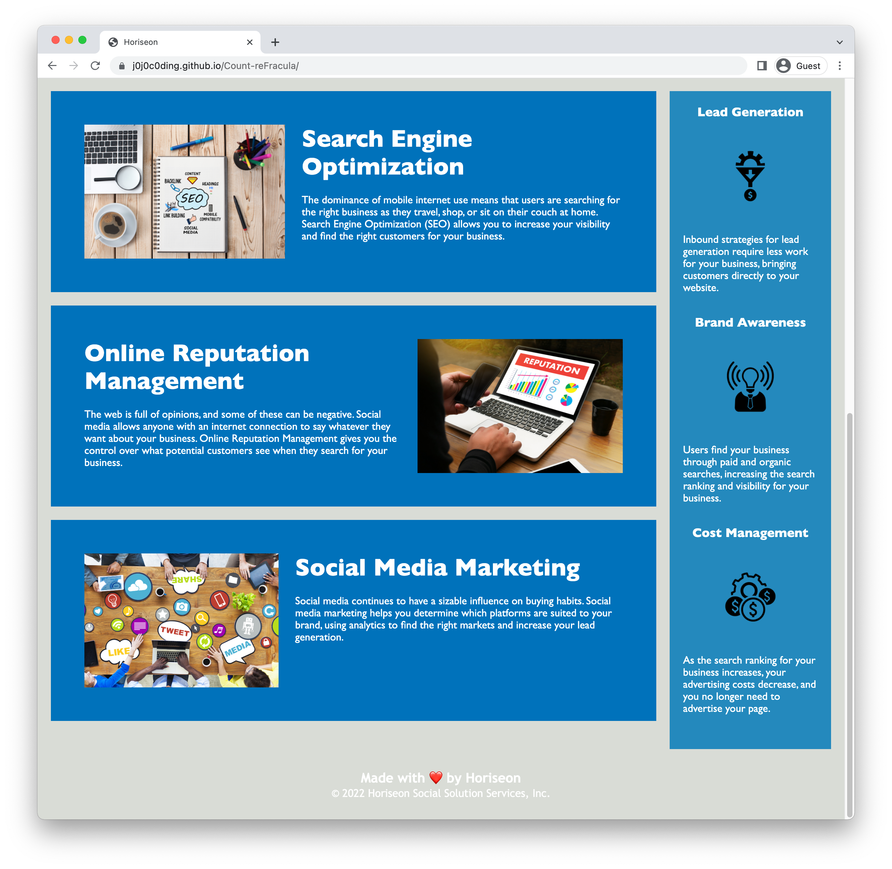

# Count-reFracula

## UMN Coding Bootcamp HTML CSS Git Challenge: Code Refactor

This repository contains code from the first UMN Bootcamp Coding challenge. 

The original, first commit contains the original code supplied to refactor. I was tasked to edit the supplemental **HTML** and **CSS** files to be more *efficient*, *clean*, and *accessible*. 

This included:  
- Adding alt attributes to images/icons  
- Merging redundant classes.  
- and so much more! 

## Screenshots of Website

## Link to Deployed Application
[Count reFracual](https://j0j0c0ding.github.io/Count-reFracula/)
